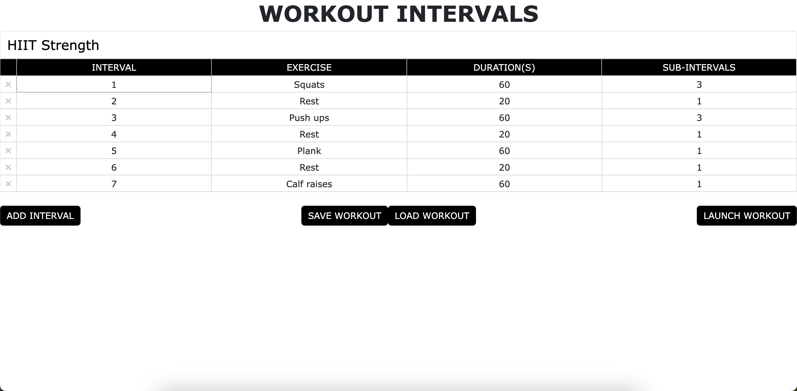
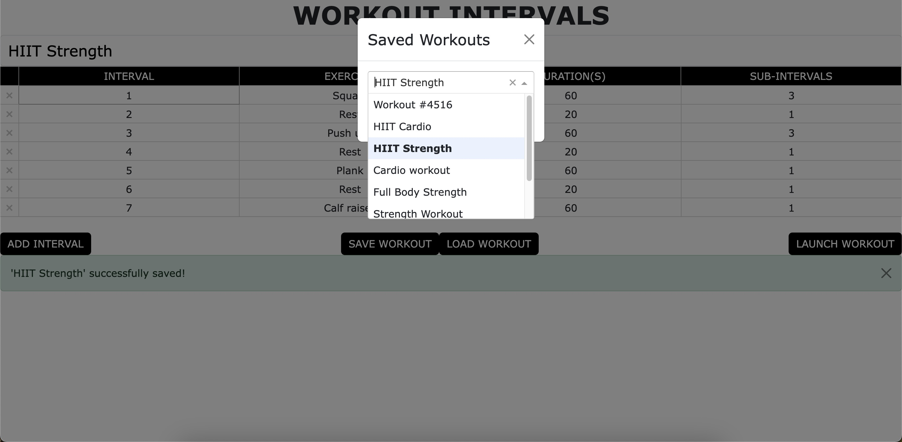
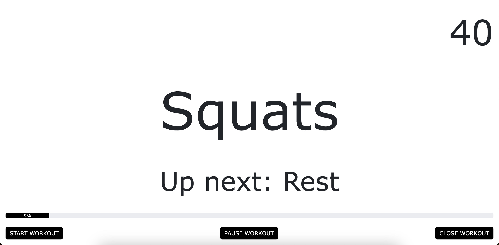

# About the app
This app allows you to create and use custom interval training workouts.

## Create a workout
\
Specify the name of the interval, the number of seconds the interval should last, and whether there are any sub-intervals.
The app will make sounds whenever a new interval starts or whenever a sub-interval is reached.\
For example, the app will make a *bell* sound when the workout begins, make a *beep* sound when the "Squats" interval begins,
and make short *beep* sounds 3 times within the "Squats" interval (this is useful if for example you want to incorporate isometric 
holds into the interval - so you might squat for 20 seconds, hold for 20 seconds, and then squat for 20 more before moving onto the 
next interval).
\

\
Option to save the workout to redis and load previously saved workouts

## Run the workout
\
Begin the workout and follow along based on the instructions on the screen. Includes a countdown to see how long is left in each interval, a progress bar
to see how much of the workout you have completed, and a preview of the next interval. Listen for the *beep* sounds to signify a change in interval or 
sub-interval change.

# Running the app locally
1. Clone this repository

    `git clone https://github.com/sstripps1/workout-intervals.git`

2. Create a virtual environment and install the requirements

    ```
    python -m venv my-venv
    source my-venv/bin/activate # Windows: \my-venv\scripts\activate
    pip install -r requirements.txt
    ```
    *Note: must have python installed on machine*

3. Run the app

    `python app.py`

__Optional steps to enable saving workouts__


4. Ensure redis is installed (if not, can install [from here](https://redis.io/downloads/))

5. Start the redis-server
    ```
    redis-server
    ```

6. Create an `env` file containing the redis url, e.g.
    ```
    REDIS_URL="redis://127.0.0.1:6379"
    ```
    *Note: must run `source env` in terminal for this variable to be recognized*